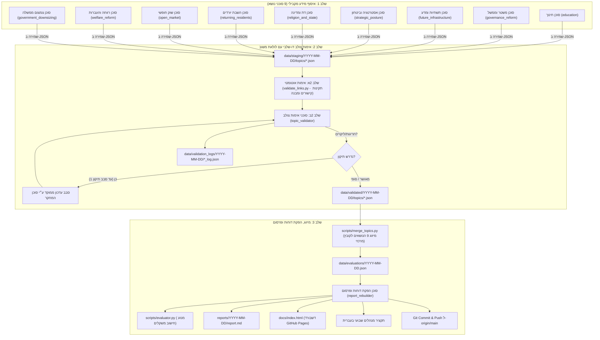

# Election Analyst 2026 - מיומנות ניתוח בחירות לכנסת 2026 (ארכיטקטורת רב-סוכנים מקבילית)

מיומנות זו מנחה את סוכן Antigravity בהפעלת מערכת רב-סוכנים מקבילית (Parallel Multi-Agent System) לביצוע ניתוח שבועי מקיף, אובייקטיבי ומבוסס ראיות של המפלגות והמועמדים לקראת הבחירות לכנסת ה-26.

---

## 🏛️ ארכיטקטורת שלוש השכבות (Three-Tier Multi-Agent Pipeline)

המערכת פועלת באמצעות שלושה סוגי סוכנים ושלבי עבודה מוגדרים:



---

## 📂 מבנה התיקיות והנתונים

- `data/staging/YYYY-MM-DD/topics/<topic_id>.json`: ממצאי מחקר גולמיים מ-9 סוכני האיסוף.
- `data/validated/YYYY-MM-DD/topics/<topic_id>.json`: נתונים מאומתים לאחר בדיקת קישורים ואימות מחוון.
- `data/validation_logs/YYYY-MM-DD/`: יומן בקרה וביקורת (קישורים תקינים, תיקונים והתאמות ציונים).
- `data/evaluations/YYYY-MM-DD.json`: מסד הנתונים השבועי המלא והממוזג.
- `reports/YYYY-MM-DD/report.md`: דו"ח Markdown מפורט.
- `docs/index.html`: אתר אינטראקטיבי RTL ל-GitHub Pages.

---

## 🤖 הגדרת הסוכנים ותפקידיהם

### 1. סוכן איסוף מידע לפי נושא (`topic_researcher`)
- **חלוקה מקבילית**: מופעלים 9 סוכנים במקביל באמצעות `invoke_subagent`. כל סוכן מקבל נושא בודד וחוקר את כל המפלגות שעברו את אחוז החסימה (לפי `config/polls.yaml`).
- **קריטריונים**: 6 קריטריונים לפי מחוון הניתוח (`c1_platform` עד `c6_designated_executive`).
- **ציטוטים**: חובת ציטוט ישיר, שם מקור וקישור URL פעיל.
- **תבנית הנחיה**: [researcher_prompt.md](./references/researcher_prompt.md).

### 2. סוכן אימות צולב (`topic_validator`)
- **שלב ראשון (Automated Tier-1)**: הרצת `python3 scripts/validate_links.py` לבדיקת זמינות HTTP של כל הקישורים ותקינות מבנה ה-JSON.
- **שלב שני (Substantive Tier-2)**: בדיקת אמיתות הציטוטים, וידוא שהמועמדים המצוינים נמצאים בטווח המקומות הריאליים (`realistic_cutoff`), ובדיקת כיול ציונים הוגן מול המחוון.
- **לולאת משוב (Feedback Loop)**: במקרה של ליקוי, נשלחת הודעת משוב לסוכן המחקר. מוגבל ל-**סבב תיקון אחד (1 round)**. אם לא תוקן, המאמת מבצע התאמה סופית ומתעד ביומן הביקורת.
- **תבנית הנחיה**: [validator_prompt.md](./references/validator_prompt.md).

### 3. סוכן הפקת דוחות ופרסום (`report_rebuilder`)
- **מיזוג**: הרצת `python3 scripts/merge_topics.py` למיזוג 9 קובצי הנושאים המאומתים למסד נתונים מרכזי.
- **חישוב והפקה**: הרצת `python3 scripts/run_analysis.py` לחישוב הציונים והפקת `report.md` ו-`docs/index.html`.
- **תקציר מנהלים (Executive Synthesis)**: ניסוח סקירה תמציתית בעברית של לוח המובילים, שינויים שבועיים ופערים בין הגושים.
- **פרסום אוטומטי**: ביצוע `git add`, `git commit` ו-`git push origin main` לעדכון מיידי של GitHub Pages.
- **תבנית הנחיה**: [rebuilder_prompt.md](./references/rebuilder_prompt.md).

---

## 🛠️ כלי CLI שימושיים
```bash
# אימות קישורים ומבנה (Staging או Validated)
python3 scripts/validate_links.py data/staging/YYYY-MM-DD/topics --skip-http

# מיזוג קובצי נושאים לקובץ מרכזי
python3 scripts/merge_topics.py --topics-dir data/validated/YYYY-MM-DD/topics --output data/evaluations/YYYY-MM-DD.json --date YYYY-MM-DD

# הפעלה כוללת או שלבית באמצעות האורקסטרטור
python3 scripts/orchestrate_analysis.py --date YYYY-MM-DD --stage all --skip-http
```
