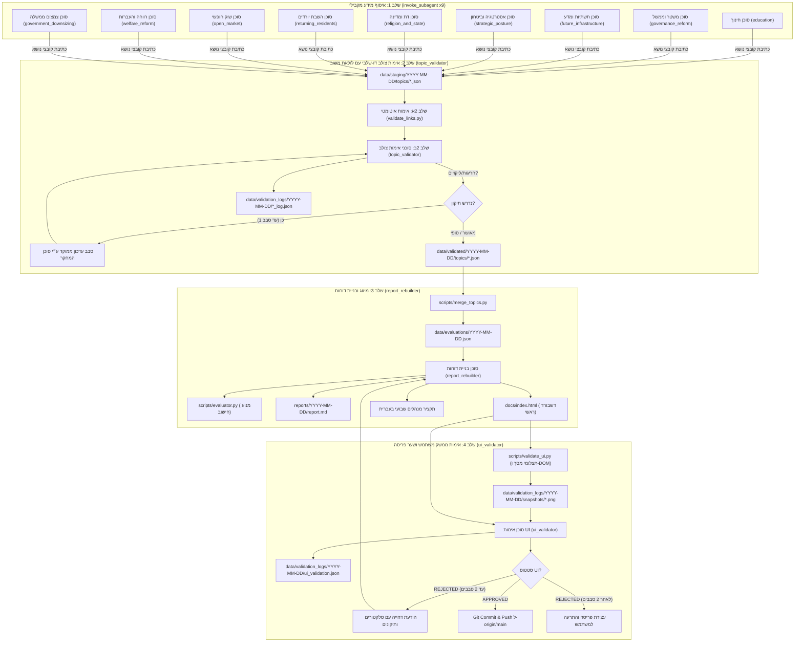

# Election Analyst 2026 - מיומנות ניתוח בחירות לכנסת 2026 (נוהל הפעלת רב-סוכנים מחייב)

> ⚠️ **כלל ברזל (Strict Prohibition)**:  
> חל איסור מוחלט על הפעלה מונוליטית מקומית של סקריפטים או העתקת נתונים מסבבים קודמים ללא הפעלת תהליך הרב-סוכנים.  
> כל בקשה להרצת ניתוח, עדכון שבועי או סבב דוחות מלא מחייבת הגדרה והפעלה של הסוכנים הייעודיים באמצעות כלי `define_subagent` ו-`invoke_subagent`.

---

## 🏛️ ארכיטקטורת ארבע השכבות (Four-Phase Multi-Agent Pipeline)



---

## 🤖 נוהל הפעלת סוכנים צעד-אחר-צעד (Step-by-Step Invocation Protocol)

כאשר מתקבלת פקודה להרצת סבב מלא (Full Report Round):

### שלב 0: הגדרת טיפוסי הסוכנים (`define_subagent`)
יש לוודא הגדרה של 4 טיפוסי הסוכנים בשיחה:
1. `name: "topic_researcher"`:
   - `description`: "Subagent that performs deep web research and evidence gathering for a single policy topic across all qualifying parties"
   - `enable_write_tools: true`
   - `system_prompt`: מבוסס על `references/researcher_prompt.md`.
2. `name: "topic_validator"`:
   - `description`: "Subagent that cross-validates topic findings against the 6-criteria rubric and checks citation authenticity"
   - `enable_write_tools: true`
   - `system_prompt`: מבוסס על `references/validator_prompt.md`.
3. `name: "report_rebuilder"`:
   - `description`: "Subagent that merges validated datasets, calculates weighted scores, writes the Hebrew executive synthesis, and produces reports"
   - `enable_write_tools: true`
   - `system_prompt`: מבוסס על `references/rebuilder_prompt.md`.
4. `name: "ui_validator"`:
   - `description`: "Subagent that verifies HTML DOM, RTL rendering, responsive layouts, captures browser snapshots, and gates deployment"
   - `enable_write_tools: true`
   - `system_prompt`: מבוסס על `references/ui_validator_prompt.md`.

---

### שלב 1: הפעלה מקבילית של 9 סוכני איסוף (`invoke_subagent`)
קריאה אחת לכלי `invoke_subagent` עם מערך של 9 סוכנים עבור 9 הנושאים במקביל:
```json
{
  "Subagents": [
    {"TypeName": "topic_researcher", "Role": "Researcher: Education", "Prompt": "Investigate topic 'education' across all qualifying parties for {DATE}..."},
    {"TypeName": "topic_researcher", "Role": "Researcher: Governance Reform", "Prompt": "Investigate topic 'governance_reform' across all qualifying parties for {DATE}..."},
    {"TypeName": "topic_researcher", "Role": "Researcher: Future Infrastructure", "Prompt": "Investigate topic 'future_infrastructure' across all qualifying parties for {DATE}..."},
    {"TypeName": "topic_researcher", "Role": "Researcher: Strategic Posture", "Prompt": "Investigate topic 'strategic_posture' across all qualifying parties for {DATE}..."},
    {"TypeName": "topic_researcher", "Role": "Researcher: Religion & State", "Prompt": "Investigate topic 'religion_and_state' across all qualifying parties for {DATE}..."},
    {"TypeName": "topic_researcher", "Role": "Researcher: Returning Residents", "Prompt": "Investigate topic 'returning_residents' across all qualifying parties for {DATE}..."},
    {"TypeName": "topic_researcher", "Role": "Researcher: Open Market", "Prompt": "Investigate topic 'open_market' across all qualifying parties for {DATE}..."},
    {"TypeName": "topic_researcher", "Role": "Researcher: Welfare Reform", "Prompt": "Investigate topic 'welfare_reform' across all qualifying parties for {DATE}..."},
    {"TypeName": "topic_researcher", "Role": "Researcher: Government Downsizing", "Prompt": "Investigate topic 'government_downsizing' across all qualifying parties for {DATE}..."}
  ]
}
```
הפלט נשמר ב: `data/staging/{DATE}/topics/<topic_id>.json`.

---

### שלב 2: אימות צולב ולולאת משוב
1. הרצת בדיקה אוטומטית מקדימה:
   ```bash
   python3 scripts/validate_links.py data/staging/{DATE}/topics --report data/validation_logs/{DATE}/tier1_summary.json
   ```
2. הפעלת סוכני אימות צולב (`topic_validator`) באמצעות `invoke_subagent` לבדיקת מהותית של עמידה במחוון הקריטריונים, מקורות אמינים וספי מועמדים ריאליים.
3. במידת הצורך, שידור הודעת משוב (`send_message`) לסוכן המחקר לסבב תיקון אחד.
4. שמירת התוצרים המאושרים ב-`data/validated/{DATE}/topics/<topic_id>.json` ויומן ב-`data/validation_logs/{DATE}/`.

---

### שלב 3: מיזוג ובניית דוחות (`report_rebuilder`)
הפעלת סוכן `report_rebuilder` באמצעות `invoke_subagent`:
1. מיזוג 9 הנושאים באמצעות `scripts/merge_topics.py` ל-`data/evaluations/{DATE}.json`.
2. חישוב ציונים והפקת דוחות באמצעות `scripts/run_analysis.py`.
3. ניסוח תקציר מנהלים שבועי בעברית (Executive Synthesis).

---

### שלב 4: אימות UI ושער פריסה (`ui_validator`)
הפעלת סוכן `ui_validator` באמצעות `invoke_subagent`:
1. הרצת `python3 scripts/validate_ui.py --date {DATE} --strict`.
2. בחינת תצלומי מסך (Desktop 1280x800 ו-Mobile 375x812) ווידוא תקינות חזותית מלאה (RTL, טבלאות, כרטיסי מובילים).
3. אם נמצאו ליקויים: שידור הודעת Reject מובנית לסוכן `report_rebuilder` (עד 2 סבבי תיקון).
4. אם הכל תקין: עדכון סטטוס `APPROVED` ב-`data/validation_logs/{DATE}/ui_validation.json` וביצוע פריסה ל-GitHub Pages:
   ```bash
   git add data/ reports/ docs/
   git commit -m "Weekly election analysis update: {DATE} [UI Validated]"
   git push origin main
   ```
