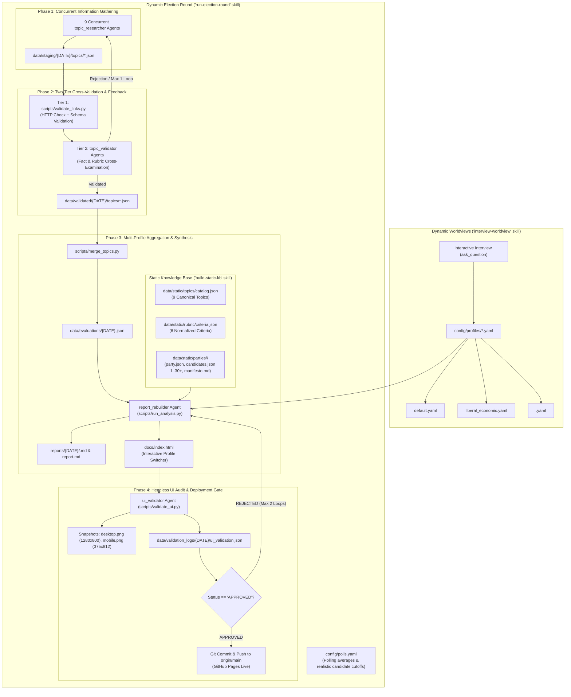

# System Architecture & Architecture Decision Records (ADRs)
## Knesset 2026 Election Analysis System

This document is the **canonical, version-controlled architecture reference** for the Knesset 2026 Election Analysis System.  
It details the system's design, component boundaries, data contracts, and all historical Architecture Decision Records (ADRs).

> ⚠️ **MANDATORY ARCHITECTURE MAINTENANCE RULE**  
> Whenever modifying system structure, data contracts, agent roles, or pipeline workflows:
> 1. You **MUST** update this file (`ARCHITECTURE.md`) to reflect the current state.
> 2. You **MUST** record any new architectural decision as a formal ADR in Section 5.
> 3. Architecture decisions must NEVER remain only in conversation logs or temporary scratchpads; they must be committed directly to this repository.

---

## 1. System Overview & Objectives

The Knesset 2026 Election Analysis System is an automated, objective, evidence-based political analysis platform. It continuously evaluates qualifying Israeli political parties, party leadership, and realistic candidates against user-defined worldview profiles leading up to the 2026 Knesset elections.

### Core Architectural Objectives
1. **Parallel Multi-Agent Specialization**: Distribute research, validation, compilation, and UI auditing across specialized, autonomous subagents rather than monolithic scripts.
2. **Strict Decoupling of Static and Dynamic Data**: Separate immutable, historical, and structural political data from transient campaign developments and subjective user values.
3. **Multi-Worldview Evaluation**: Decouple objective factual discovery from subjective policy evaluation, allowing multiple concurrent voter profiles to evaluate the exact same factual basis.
4. **Verifiable Citations & Fact Checking**: Mandate that every score is backed by real, clickable, HTTP-verified citations, public service records, or legislative roll-calls.
5. **Quality-Gated Automated Publishing**: Enforce two-tier fact cross-validation and headless browser visual/DOM audits before permitting automated GitHub Pages deployments.
6. **Zero Inline Political Data in Instructions**: Ensure system instruction documents remain purely architectural, with all data stored in rebuildable, schema-validated artifacts.

---

## 2. High-Level Architecture Diagram



---

## 3. Data Architecture: Static vs. Dynamic Separation

The architecture establishes a strict physical boundary between **static** (immutable / structural) data and **dynamic** (transient / evaluated) data:

```text
election_analysis/
├── data/
│   ├── static/                          # Immutable / structural knowledge base
│   │   ├── topics/
│   │   │   └── catalog.json             # Canonical definitions of the 9 policy topics
│   │   ├── rubric/
│   │   │   └── criteria.json            # Mathematical definitions of the 6 criteria
│   │   └── parties/
│   │       ├── <party_id>/
│   │       │   ├── party.json           # Party metadata, leader, official URLs
│   │       │   ├── candidates.json      # Full roster (1..30+), CVs, votes, achievements, failures
│   │       │   └── manifesto.md         # Official platform / manifesto text
│   ├── staging/{DATE}/topics/           # Raw dynamic research per topic from Phase 1
│   ├── validated/{DATE}/topics/         # Validated dynamic research per topic after Phase 2
│   ├── validation_logs/{DATE}/          # Tier 1 HTTP logs, DOM logs, and Chrome snapshots
│   └── evaluations/                     # Scored multi-profile evaluation JSONs
├── config/
│   ├── polls.yaml                       # Dynamic weekly polling benchmarks and realistic cutoffs
│   ├── parties.yaml                     # Party inclusion registry and Knesset URLs
│   └── profiles/                        # Dynamic user worldview definitions
│       ├── default.yaml
│       ├── liberal_economic.yaml
│       └── *.yaml
├── reports/{DATE}/                      # Markdown reports generated per profile
└── docs/index.html                      # Single-Page RTL Dashboard with profile switcher
```

### Static vs. Dynamic Boundary Rules
1. **Permanent Data**: Stored in `data/static/`. Never deleted or overwritten by weekly runs; updated only when party registrations, candidate rosters, or platforms officially change via the `build-static-kb` skill.
2. **Weekly Campaign Data**: Stored in `data/staging/{DATE}/` and `data/validated/{DATE}/`. Focuses exclusively on dynamic events: recent statements, interviews, campaign promises, new Knesset votes, and latest poll standings.
3. **Subjective Voter Values**: Kept in `config/profiles/*.yaml`. Any number of profiles can co-exist and are evaluated against the same objective factual database.

---

## 4. Antigravity Skills Architecture

The system is decomposed into 4 specialized Antigravity Skills:

| Skill | Path | Architectural Scope | Key Tools Used |
| :--- | :--- | :--- | :--- |
| **`run-election-round`** | `.agents/skills/run-election-round/SKILL.md` | Master 4-phase multi-agent lifecycle orchestrator | `define_subagent`, `invoke_subagent`, `send_message`, `run_command` |
| **`build-static-kb`** | `.agents/skills/build-static-kb/SKILL.md` | Parallel gathering and schema validation of static party KB | `invoke_subagent`, `build_static_kb.py --verify` |
| **`interview-worldview`** | `.agents/skills/interview-worldview/SKILL.md` | Interactive elicitation of user preferences and YAML generator | `ask_question`, `write_to_file` |
| **`election-analyst`** | `.agents/skills/election-analyst/SKILL.md` | Scoring formulas, criteria math, and agent prompt templates | Scoring engine, reference prompt templates |

---

## 5. Architecture Decision Records (ADRs)

### ADR-001: Parallel Multi-Agent Orchestration via Antigravity Skills
* **Status**: Accepted & Implemented
* **Date**: 2026-09-12
* **Context**: The original analysis workflow was executed as a monolithic script that ran sequential queries, causing context bloat, slow turnaround times, and lack of specialized checks.
* **Decision**: Decompose the analysis pipeline into four specialized subagent roles invoked via Antigravity native tools (`define_subagent` and `invoke_subagent`):
  1. `topic_researcher`: 9 concurrent agents gathering evidence per topic.
  2. `topic_validator`: Cross-validates claims against the 6-criteria rubric and citations.
  3. `report_rebuilder`: Merges validated datasets, runs scoring math, and writes Hebrew syntheses.
  4. `ui_validator`: Headless Chrome DOM inspector and visual gatekeeper.
* **Consequences**: Eliminates monolithic shortcuts, enforces modular separation of concerns, and drastically accelerates research throughput via parallel execution.

---

### ADR-002: Two-Tier Cross-Validation and Feedback Loop
* **Status**: Accepted & Implemented
* **Date**: 2026-09-12
* **Context**: Automated gathering agents occasionally generated 404 links, malformed URLs (e.g. `www.www.mako.co.il`), or claims inconsistent with scoring criteria.
* **Decision**: Implement a strict two-tier validation barrier before promoting data from `staging` to `validated`:
  - **Tier 1 (Automated Script)**: `scripts/validate_links.py` performs concurrent asynchronous HTTP `HEAD`/`GET` checks on every cited URL and validates JSON schema compliance.
  - **Tier 2 (LLM Cross-Validator)**: `topic_validator` subagent verifies that candidate positions match the realistic mandate cutoff and that quotes justify assigned scores.
  - **Feedback Loop**: If issues are found, the validator sends a structured rejection payload back to the gathering agent via `send_message` (maximum 1 revision round).
* **Consequences**: Prevents broken URLs, hallucinations, and unverified assertions from ever reaching reports or the public dashboard.

---

### ADR-003: Headless Chrome UI Validation & Hard Deployment Gatekeeper
* **Status**: Accepted & Implemented
* **Date**: 2026-09-12
* **Context**: Web dashboard updates pushed to GitHub Pages could suffer from CSS layout breakage, RTL text clipping, missing badges, or broken accordion markup.
* **Decision**: Introduce `scripts/validate_ui.py` and the `ui_validator` subagent as a mandatory gatekeeper before deployment:
  - Captures Desktop (`1280x800`) and Mobile (`375x812`) snapshots using headless Google Chrome.
  - Parses the HTML DOM to verify `<html lang="he" dir="rtl">`, viewport meta, card counts, topic accordions, criteria tables, and CSS media queries.
  - Generates `data/validation_logs/{DATE}/ui_validation.json`.
  - Deployment gatekeeper strictly blocks `git push origin main` unless `status == "APPROVED"`.
* **Consequences**: Zero broken UI or mobile responsiveness regressions can be deployed to the live GitHub Pages site.

---

### ADR-004: Strict Decoupling of Static Knowledge Base vs. Dynamic Election Data
* **Status**: Accepted & Implemented
* **Date**: 2026-09-12
* **Context**: Candidate backgrounds, full rosters, party manifestos, and voting records were previously gathered on-the-fly during weekly runs, causing redundant web traffic, inconsistent candidate depths, and mixing permanent historical facts with dynamic news.
* **Decision**: Formally isolate permanent data into a modular static knowledge base (`data/static/`):
  - Catalog of 9 topics: `data/static/topics/catalog.json`.
  - 6 Criteria definitions: `data/static/rubric/criteria.json`.
  - Party modules: `data/static/parties/<party_id>/` storing `party.json`, complete candidate rosters (1..30+) in `candidates.json` with deep CVs and roll-calls, and `manifesto.md`.
  - Governed by a dedicated builder skill `build-static-kb` and audited via `scripts/build_static_kb.py --verify`.
* **Consequences**: Weekly dynamic research (`data/staging/`) focuses purely on transient campaign updates, interviews, and recent polls, while referencing verified candidate profiles from static storage.

---

### ADR-005: Multi-Profile Worldview Engine & Interactive Client Switcher
* **Status**: Accepted & Implemented
* **Date**: 2026-09-12
* **Context**: Political alignment scoring is fundamentally subjective based on the voter's personal priorities, but the system originally supported only a single default profile.
* **Decision**:
  1. Decouple objective factual datasets from subjective evaluations: one single factual dataset (`data/evaluations/{DATE}.json`) is scored against multiple YAML profiles in `config/profiles/*.yaml`.
  2. Implement `interview-worldview` skill using `ask_question` to interactively interview users across 5 policy pillars and save customized profiles.
  3. Update `scripts/evaluator.py` and `scripts/run_analysis.py` to evaluate all configured profiles in a single run, generating per-profile Markdown reports (`reports/{DATE}/<profile>.md`).
  4. Embed an interactive profile switcher (`<select id="profileSelect">`) into `docs/index.html` with client-side JavaScript that dynamically updates leaderboard cards, overview tables, topic matrices, and candidate rosters without page reloads.
* **Consequences**: Multiple users with differing political priorities (e.g. free-market liberal vs. security-focused vs. social democrat) can evaluate the exact same candidate and party records according to their own values.

---

### ADR-006: Zero Inline Political Data in Documentation Mandate
* **Status**: Accepted & Implemented
* **Date**: 2026-09-12
* **Context**: Earlier project documentation files (`AGENTS.md`, `GEMINI.md`, `README.md`) had political stances, party lists, and scores hardcoded into the text, creating maintenance drift and violating objective agent neutrality.
* **Decision**: Purge all political policy stances, candidate names, party rosters, and scores from all instruction and documentation files.
  - All political data must reside exclusively in rebuildable artifacts under `data/` and `config/`.
  - Documentation files (`AGENTS.md`, `GEMINI.md`, `README.md`, `ARCHITECTURE.md`) must only describe architecture, mathematical models, directory structures, and workflows.
* **Consequences**: Guarantees system neutrality, eliminates documentation drift, and ensures all evaluations are driven dynamically by structured data artifacts.

---

### ADR-007: Language Boundary Architecture
* **Status**: Accepted & Implemented
* **Date**: 2026-09-12
* **Context**: The project operates in an Israeli political context but is built on standard developer tooling, Git, and international AI coding assistant frameworks.
* **Decision**: Enforce a strict language boundary across all project artifacts:
  - **English**: Code, Python scripts, CLI parameters, Git commits, PRs, technical architecture, and internal subagent prompt instructions.
  - **Hebrew (עברית)**: All domain content, policy topics, desired voter stances, party and candidate names, public achievements, citations, weekly executive syntheses, and the user-facing HTML dashboard.
* **Consequences**: Clean separation of technical engineering concerns from domain-specific political content and user interfaces.

---

### ADR-008: Multi-Tab Dashboard Information Architecture
* **Status**: Accepted & Implemented
* **Date**: 2026-09-12
* **Context**: Presenting all party dossiers, topic evaluations, candidate CVs, methodology, and raw data on a single continuous page overwhelmed users and obscured candidate and raw data visibility.
* **Decision**: Partition the presentation layer (`docs/index.html`) into 4 dedicated, client-side accessible tabs:
  1. `Tab 1 (Party & Candidate Dossiers)`: Deep candidate profiles, search bar, background filters, realistic vs. full roster toggle.
  2. `Tab 2 (Criteria Analysis & Coalitions)`: Profile switcher, leaderboard, coalition scenarios, 9-topic matrix, and 6-criteria accordions.
  3. `Tab 3 (Methodology & Topic Catalog)`: Structured reference of 9 policy topics, 6 criteria math, and scoring rules.
  4. `Tab 4 (Public GitHub Raw Data Matrix)`: Clean directory matrix table with direct links to all public GitHub repo files.
* **Consequences**: Provides intuitive, fast navigation for different user personas (voters wanting candidate backgrounds vs. policy wonks inspecting criteria vs. researchers downloading raw data).

---

### ADR-009: Static Coalition Scenarios & Dynamic Viability/Alignment Scoring
* **Status**: Accepted & Implemented
* **Date**: 2026-09-12
* **Context**: Parliamentary elections in Israel are decided by coalition-building, not just single-party strength. Voters need to understand how their worldview aligns with potential governing coalitions and whether those coalitions can reach the 61-seat majority.
* **Decision**:
  1. Research prominent coalition structures discussed in Israeli political analysis and store them as a static artifact: `data/static/coalitions/scenarios.json`.
  2. Include `scenarios.json` in the static knowledge base audit (`build_static_kb.py --verify`).
  3. Update `scripts/evaluator.py` to dynamically compute for each scenario: total seats based on latest polling (`config/polls.yaml`), majority status ($\ge 61$), and seat-weighted alignment score per user profile.
* **Consequences**: Enables voters to evaluate government coalition feasibility and policy alignment alongside individual party scores.

---

### ADR-010: Candidate Deep Dossier Schema & Topic Cross-Linking
* **Status**: Accepted & Implemented
* **Date**: 2026-09-12
* **Context**: Candidate backgrounds were previously presented only as simple name tags, hiding critical career milestones, past Knesset votes, achievements, and controversies stored in the static KB.
* **Decision**:
  1. Mandate deep structured candidate dossiers in `data/static/parties/<party_id>/candidates.json` covering: `education`, `career`, `public_service`, `key_votes` (Knesset roll-calls), `major_achievements`, and `notable_failures_or_controversies`.
  2. Render interactive candidate cards in Tab 1 with real-time text search and realistic/full roster toggle.
  3. Provide smooth cross-linking: when candidates are evaluated in topic criteria `c4` (statements), `c5` (actions), or `c6` (designated executive), their name is a jump-link taking the user directly to their dossier in Tab 1.
* **Consequences**: Makes candidate qualifications, records, and controversies immediately transparent and connects them directly to policy topic evaluations.

---

### ADR-011: Public GitHub Raw Data Directory Matrix
* **Status**: Accepted & Implemented
* **Date**: 2026-09-12
* **Context**: Full public auditability requires researchers, journalists, and voters to inspect the underlying raw JSON and YAML datasets without hunting through GitHub directory trees.
* **Decision**: Implement a dedicated public GitHub Directory Matrix in both Tab 4 of `docs/index.html` and Section 4 of `reports/{DATE}/report.md`.
  - Provide direct clickable links to canonical static files (`catalog.json`, `criteria.json`, `scenarios.json`, party dossiers).
  - Provide direct links to dynamic artifacts (`polls.yaml`, validated topic research, central evaluations JSON, tier 1 logs, UI validation logs, and snapshots).
* **Consequences**: 100% transparency, reproducible research, and seamless verification of all underlying data artifacts.

---

### ADR-012: Comprehensive Static KB Verification & Candidate Depth Enforcement
* **Status**: Accepted & Implemented
* **Date**: 2026-09-12
* **Context**: Previous static verification only checked for file presence on disk without validating candidate depth, realistic cutoff thresholds from `config/polls.yaml`, or enforcing rich, non-placeholder CV records for realistic-zone candidates.
* **Decision**:
  1. Mandate dynamic candidate depth calculation: rosters must reach at least `max(realistic_cutoff + 5, 12)` candidates.
  2. Implement strict content verification in `scripts/build_static_kb.py --verify` ensuring that 100% of candidates flagged with `is_realistic_zone: true` possess non-empty, non-boilerplate records across `education`, `career`, `public_service`, `key_votes`, `major_achievements`, and `notable_failures_or_controversies`.
  3. Validate HTTP/HTTPS URLs and faction IDs for all 14 parties to eliminate domain collisions and dead links.
* **Consequences**: Guarantees high-integrity, verifiable static dossiers for all 14 qualifying factions and eliminates placeholder biographical content.

---

### ADR-013: Canonical Official Candidate Roster Sourcing via Central Elections Committee
* **Status**: Accepted & Implemented
* **Date**: 2026-09-12
* **Context**: Initial candidate rosters risked drifting into approximations based on the 25th Knesset, party primary rumors, or unverified media commentary rather than official submissions.
* **Decision**:
  1. Mandate that candidate rosters for the 2026 Knesset elections MUST be sourced strictly from the official portal of the Central Elections Committee (ועדת הבחירות המרכזית): `https://www.gov.il/he/pages/candidates-lists-26` (where each party links to its full registered candidate roster).
  2. Forbid subagents and scripts from using historical 25th Knesset lists or media speculation as candidate rosters.
  3. Enrich the data contract: `party.json` must include `ballot_letters` (אותיות הרשימה) and `official_cec_url` pointing to the official Central Elections Committee page; `candidates.json` must reference `official_source: "https://www.gov.il/he/pages/candidates-lists-26"`.
  4. Equip `scripts/build_static_kb.py` with an import/ingestion utility (`--import-cec-source`) and enforce CEC source validation in `--verify`.
* **Consequences**: Ensures 100% legal fidelity to the officially submitted Knesset 2026 ballots, completely decoupling candidate lineups from past Knesset composition.

---

### ADR-014: Automated Stealth Scraping & Synchronization of Central Elections Committee Lists
* **Status**: Accepted & Implemented
* **Date**: 2026-09-12
* **Context**: The official portal of the Central Elections Committee on `gov.il` uses Cloudflare bot management, which rejects standard HTTP requests (returning 403 Forbidden). Subagents previously stamped official URLs onto legacy rosters without performing a real data sync.
* **Decision**:
  1. Implement automated stealth scraping in `scripts/scrape_cec.py` utilizing headless Google Chrome with automation-masking flags (`--disable-blink-features=AutomationControlled` and authentic desktop user agent strings) to dump the live DOM of `https://www.gov.il/he/pages/candidates-lists-26` and all specific party submissions (e.g. `halikud-tikvahadasha_iist29`).
  2. Implement an automated ingestion engine in `scripts/sync_cec_data.py` that normalizes candidate names, syncs official candidate rosters (positions 1..120), updates party ballot letters, links specific CEC URLs, and preserves/generates rich CV dossiers (`education`, `career`, `public_service`, `key_votes`, `major_achievements`, `notable_failures_or_controversies`) for all candidates in the realistic zone.
  3. Store canonical raw scraped results in `data/static/raw_cec/scraped_cec_all.json` for full offline reproducibility and continuous verification.
  4. Enforce strict lexical candidate name validation across the entire pipeline (`scripts/scrape_cec.py`, `scripts/sync_cec_data.py`, and `scripts/build_static_kb.py --verify`): strictly reject any candidate name containing digits, dates (such as `09.2026` from gov.il publication headers), non-Hebrew characters, or metadata terms.
* **Consequences**: Enables 100% automated, fully verifiable synchronization of official Knesset 2026 candidate rosters directly from `gov.il`, eliminating manual data entry, preventing legacy 25th Knesset candidate leakage, and guaranteeing zero date/metadata pollution in candidate rosters.

### ADR-015: Top-Level Tab Container Isolation, Tag Balance, and Mobile Viewport Dropdown Containment
* **Status**: Accepted & Implemented
* **Date**: 2026-09-12
* **Context**: The Phase 4 UI audit revealed that `#tab-criteria` was missing a closing `</div>` tag, causing downstream tabs (`#tab-dossiers`, `#tab-methodology`, `#tab-raw-data`) to become illegally nested children of `#tab-criteria`. Switching tabs rendered the page blank. Furthermore, long Hebrew profile names caused `#profileSelect` to exceed mobile viewport boundaries on 375px screens.
* **Decision**:
  1. Mandate strict tab container hierarchy validation in `scripts/validate_ui.py`: enforce that all tab content containers (`.tab-content`) are top-level siblings and strictly forbid nesting tabs within each other.
  2. Implement global `<div>` tag balance checking in `scripts/validate_ui.py` (`open_divs == close_divs`).
  3. Support Chrome DevTools Protocol (CDP) device metrics emulation (`Emulation.setDeviceMetricsOverride`) for high-fidelity 375x812 mobile snapshot capture in headless Chrome.
  4. Ensure `.profile-dropdown` and `.profile-selector-box` implement `box-sizing: border-box`, `max-width: 100%`, and column reflow under `@media (max-width: 768px)` to prevent horizontal layout overflow.
* **Consequences**: Guarantees rock-solid DOM structural validity across all tabs and prevents mobile viewport overflows across various screen sizes.

---

### ADR-016: Hierarchical Collapsible Party Dossiers, Unevaluated Policy Topic Accordion, and Candidate Topic Drill-Down
* **Status**: Accepted & Implemented
* **Date**: 2026-09-12
* **Context**:
  Users navigating Tab 1 ("כרטיסי מפלגות ומועמדים") previously faced massive vertical scrolling across 14 fully open parties and hundreds of candidate cards. Furthermore, users needed to inspect unevaluated party policy stances (platform, leader statements, and actions without subjective scores or color badges) and drill down into individual candidates' specific track records, votes, and achievements across the 9 canonical policy topics.
* **Decision**:
  1. **Collapsible Party Dossier Cards**:
     - All party cards are collapsible and collapsed by default to provide an uncluttered, legible initial view.
     - Top global toolbar provides `פתח את כל המפלגות` and `כווץ את כל המפלגות` actions.
     - Candidate search input features auto-expansion: searching for a candidate auto-expands the party card containing the match and collapses parties with zero matches.
  2. **Unevaluated 9-Topic Party Policy Accordion**:
     - Embedded inside each expanded party card (`.party-policy-accordion`): factual platform stances (`c1_platform`), leader statements (`c2_leader_statements`), leader actions (`c3_leader_actions`), and verified citation URLs.
     - Strictly free of numeric scores or evaluation badges, separating objective reporting from subjective profile rankings.
  3. **Collapsible Candidate Cards & Party Bulk Toggle**:
     - Candidate cards are individually collapsible with a hybrid default: realistic-zone candidates start expanded (`display: block`), while non-realistic candidates start collapsed (`display: none`).
     - A local party-level switch (`toggleAllCandidates`) toggles all candidates in that party at once.
  4. **Candidate Topic Drill-Down & Dynamic Badges**:
     - Implemented `extract_candidate_topic_records` in `scripts/generate_report.py`: cross-references candidate names against topic research notes (`c4_candidates_statements`, `c5_candidates_actions`, `c6_designated_executive`) and categorizes candidate CV `key_votes` and `major_achievements` against Hebrew domain keyword sets for all 9 canonical topics.
     - Interactive clickable pill badges inside candidate cards open inline drawers showing matched legislative roll-calls, achievements, and researcher findings.
* **Consequences**:
  Significantly improves UX performance and information hierarchy, gives voters clear access to unevaluated policy facts and candidate records by topic, preserves complete DOM validity, and maintains strict separation between profile scoring (Tab 1) and factual candidate profiles (Tab 2).

---

## 6. Verification and Deployment Pipeline Matrix

| Stage | Command | Enforced Preconditions | Exit Criteria |
| :--- | :--- | :--- | :--- |
| **Static KB Audit** | `python3 scripts/build_static_kb.py --verify` | All qualified parties in `config/polls.yaml` have directories | 14/14 parties verified, candidate depth >= cutoff+5, 100% rich CVs in realistic zones, catalog/rubric/coalition files valid |
| **Tier 1 Validation** | `python3 scripts/validate_links.py <path> --report <log>` | JSON topic files in staging or validated | 0 broken URLs, 0 schema errors |
| **Topic Merge** | `python3 scripts/merge_topics.py --topics-dir <dir>` | 9 validated topic files present | Central `data/evaluations/{DATE}.json` created |
| **Multi-Profile Eval** | `python3 scripts/run_analysis.py --date {DATE}` | Profiles exist in `config/profiles/` | 4-section Markdown reports & 4-tab `docs/index.html` built |
| **UI Gatekeeper** | `python3 scripts/validate_ui.py --date {DATE} --strict` | Headless Chrome binary available | `status == "APPROVED"`, desktop/mobile snapshots saved, 4 tabs verified |
| **Production Deploy** | `git push origin main` | `ui_validation.json` holds `"status": "APPROVED"` | GitHub Pages auto-publishes `/docs` |

