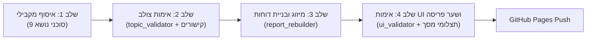

# מערכת אנליזה: בחירות לכנסת ה-26 (2026) 🇮🇱

מערכת חכמה, אובייקטיבית ומבוססת ראיות לניתוח מפלגות, ראשי מפלגות ומועמדים במקומות ריאליים לקראת הבחירות לכנסת ה-26.  
המערכת ממומשת באמצעות שתי מיומנויות Antigravity ייעודיות:
- **`run-election-round`** (`.agents/skills/run-election-round/SKILL.md`): מיומנות ההרצה המלאה המפעילה ארכיטקטורת רב-סוכנים בארבעה שלבים.
- **`election-analyst`** (`.agents/skills/election-analyst/SKILL.md`): מיומנות מתודולוגיית הניתוח, מחוון הקריטריונים ופרופיל הנושאים.

🌐 **דשבורד אינטראקטיבי פעיל ב-GitHub Pages**:  
**[https://vvainer.github.io/elections-il-2026/](https://vvainer.github.io/elections-il-2026/)**

---

## 🎯 מבנה הניתוח והמתודולוגיה

המערכת מעריכה כל מפלגה עבור **9 נושאי ליבה** מול עמדות יעד מוגדרות מראש בסולם שנע בין **100-** (התנגדות מלאה) ל-**100+** (התאמה מלאה).

### ששת קריטריוני הניתוח ומשקליהם (משקל מקורי מצטבר: 110% | מנורמל ל-100%):
1. **מצע המפלגה** (15% | מנורמל: `13.64%`): האם קיים מצע רשמי וכיצד הוא מתייחס לנושא?
2. **אמירות וכתיבה של ראש המפלגה** (15% | מנורמל: `13.64%`): עמדות, ראיונות, נאומים ורשתות חברתיות.
3. **ניסיון מעשי ופעילות ראש המפלגה** (30% | מנורמל: `27.27%`): רקורד ביצועי, רקע מקצועי/אקדמי, הצבעות וחקיקה בפועל, ושינוי עמדות (הקריטריון בעל המשקל הכבד ביותר).
4. **אמירות וכתיבה של מועמדים ריאליים** (10% | מנורמל: `9.09%`): עמדות המועמדים בטווח המנדטים הריאלי.
5. **ניסיון מעשי ופעילות של מועמדים ריאליים** (20% | מנורמל: `18.18%`): רקורד ועשייה בפועל של הנבחרת הריאלית.
6. **מועמד ריאלי ייעודי לתפקיד ביצועי** (20% | מנורמל: `18.18%`): האם יש מועמד מובהק המיועד לתיק/תפקיד ומתאים לעמדת היעד?

---

## 📋 9 נושאי הליבה המוגדרים

1. **חינוך**: התאמת צורת וחומר הלימוד לתקופה, השקעה במורים (הכשרה, שכר תחרותי, משיכת כוח אדם מעולה), דרישת תוכנית ממשלתית בכל בית ספר מתוקצב, חינוך מותאם וביזור סמכויות למנהלים.
2. **שינוי במערכת השלטון**: ביזור סמכויות לשלטון מקומי, חיזוק הכנסת מול ממשלה ומשפט, פתרון סוגיית הרשות השופטת, פיזור סמכויות יועמ"ש, התאמת הממשל והבחירות לתקופה ולטכנולוגיה, השקעה באקדמיה.
3. **בניית תשתית להצלחה של ישראל בדור הקרוב**: השקעה במדע, רובוטיקה, חלל, קוונטום, אנרגיה, מים ותשתיות.
4. **בניית מצב אסטרטגי משופר**: מעגלי שת"פ אזרחי וביטחוני נרחבים, הסכמים צבאיים, הצעה קונקרטית לסוגיה הפלסטינית ללא מסירת שטחים נרחבים וירושלים, מאבק באנטי-ציונות ובפלסטיניזציה של המערב.
5. **דת ומדינה**: גישה זהירה המאפשרת לרשויות מקומיות יותר חופש ולמדינה הגדרת כללים מנחים.
6. **תוכנית להחזרת יורדים**: תוכנית לאומית להשבת ישראלים, במיוחד רופאים, מדענים ויזמים.
7. **שוק פתוח, יזמות, הורדת חסמים**: פתיחת השוק, הסרת רגולציה וחסמי יבוא, עידוד יזמות, פירוק מונופולים.
8. **סידור מחדש של העברות**: קיום בכבוד לחסרי יכולת השתכרות, מניעת תמריצים לבטלה/עוני/חיים על חשבון המערכת והורדת עובדי חלוקה.
9. **צמצום הממשלה**: צמצום מספר השרים, משרדי הממשלה וגודל המשרדים (הגבלה ל-18 שרים).

---

## 🏛️ קריטריון סף המפלגות והמקומות הריאליים

* **כלל הסף למפלגה**: כל מפלגה שעוברת את אחוז החסימה (3.25% / 4 מנדטים) **לפחות בסקר אחד** נכללת בניתוח.
* **רף מקומות ריאליים**: ממוצע סקרים עדכני + מרווח ביטחון של 1 מנדט (לפי `config/polls.yaml`).

---

## 🚀 אופן ההרצה באמצעות מיומנות `run-election-round`

כדי להריץ סבב מלא, בקש מ-Antigravity בצ'אט:
```text
הרץ סבב רב-סוכנים מלא לבחירות 2026
```
*(או: `run a full report round` / `run-election-round`)*

Antigravity יפעיל את המיומנות **`run-election-round`** לפי נוהל רב-סוכנים מחייב בארבעה שלבים:



1. **שלב 0 (`define_subagent`)**: הגדרת 4 סוכני המשנה הייעודיים.
2. **שלב 1 (`invoke_subagent` x9)**: הפעלה מקבילית של 9 סוכני איסוף (אחד לכל נושא ליבה) ושמירה ל-`data/staging/YYYY-MM-DD/topics/*.json`.
3. **שלב 2 (אימות צולב ולולאת משוב)**: בדיקת קישורים אוטומטית (`scripts/validate_links.py`) ואימות מהותי ע״י `topic_validator`. לולאת משוב לתיקון ליקויים (עד סבב אחד) ושמירה ל-`data/validated/`.
4. **שלב 3 (מיזוג ובנייה)**: הפעלת `report_rebuilder`, מיזוג נתונים (`scripts/merge_topics.py`), חישוב ציונים (`scripts/run_analysis.py`), והפקת תקציר מנהלים שבועי בעברית.
5. **שלב 4 (אימות UI ושער פריסה)**: הפעלת `ui_validator` ללכידת תצלומי מסך Headless Chrome (`desktop.png`, `mobile.png`) ואימות DOM. חסימת פריסה במקרה של דחייה, ופריסה אוטומטית ל-GitHub Pages בעת אישור (`APPROVED`).

---

## 🌐 פרסום האתר ל-GitHub Pages

המאגר מוגדר ומפורסם ישירות ל-GitHub Pages:
- **Repository**: [https://github.com/vvainer/elections-il-2026](https://github.com/vvainer/elections-il-2026)
- **Settings -> Pages**: מוגדר לסניף `main` ותיקיית `/docs`.
- **Live Site**: [https://vvainer.github.io/elections-il-2026/](https://vvainer.github.io/elections-il-2026/)

---

## 📁 מבנה התיקיות בפרויקט

```text
election_analysis/
├── .agents/
│   └── skills/
│       ├── run-election-round/
│       │   └── SKILL.md                 # מיומנות ההרצה המלאה של סבב הרב-סוכנים
│       └── election-analyst/
│           ├── SKILL.md                 # מיומנות הליבה ומתודולוגיית הניתוח
│           └── references/
│               ├── criteria_rubric.md   # מחוון הקריטריונים המלא
│               ├── researcher_prompt.md # תבנית הנחיה לסוכני איסוף
│               ├── validator_prompt.md  # תבנית הנחיה לסוכני אימות
│               ├── rebuilder_prompt.md  # תבנית הנחיה לסוכן הפקת דוחות
│               └── ui_validator_prompt.md # תבנית הנחיה לסוכן אימות UI
├── config/
│   ├── polls.yaml                       # מעקב סקרים וספי מקומות ריאליים
│   ├── parties.yaml                     # מאגר מפלגות, מועמדים וקישורים
│   └── profiles/
│       └── default.yaml                 # 9 הנושאים, עמדות היעד ומשקלים
├── data/
│   ├── staging/YYYY-MM-DD/topics/       # ממצאי מחקר גולמיים מ-9 הסוכנים
│   ├── validated/YYYY-MM-DD/topics/     # נתונים מאומתים לאחר בדיקות
│   ├── validation_logs/YYYY-MM-DD/      # יומני אימות, תיקונים ותצלומי מסך
│   └── evaluations/YYYY-MM-DD.json      # מסד הנתונים השבועי הממוזג
├── docs/
│   └── index.html                       # הדשבורד הרספונסיבי ל-GitHub Pages
├── reports/
│   └── YYYY-MM-DD/
│       └── report.md                    # הדו"ח השבועי המפורט ב-Markdown ותקציר מנהלים
├── scripts/
│   ├── validate_links.py                # אימות קישורים ומבנה JSON מקבילי
│   ├── validate_ui.py                   # אימות DOM ולכידת תצלומי מסך Chrome
│   ├── merge_topics.py                  # מיזוג ופיצול קובצי נושאים
│   ├── evaluator.py                     # מנוע החישוב המתמטי והנרמול
│   ├── generate_report.py               # מחולל ה-Markdown וה-HTML
│   ├── run_analysis.py                  # סקריפט החישוב והפקת הדוחות
│   └── orchestrate_analysis.py          # אורקסטרטור פקודות CLI שלבי
├── AGENTS.md                            # זיכרון והנחיות Antigravity
├── GEMINI.md                            # זיכרון והנחיות Antigravity
└── README.md                            # תיעוד ראשי של הפרויקט
```
